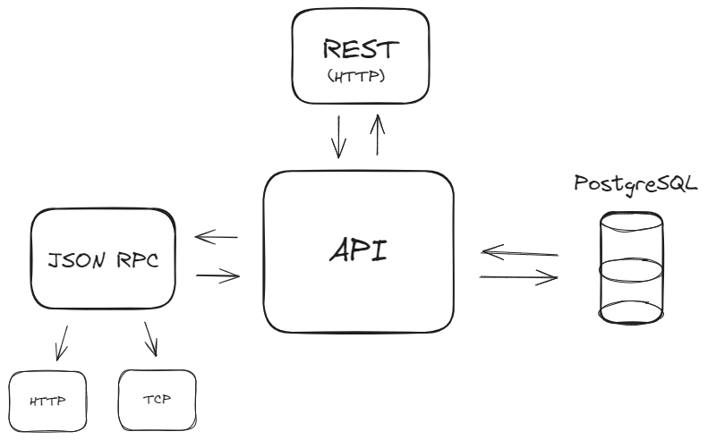

# API Node with PostgreSQL

This project is being developed for learning purposes, especially in PostgreSQL.

This API has two architectures available, one in REST and the other in JSON RPC, and the RPC version has two ways to be consumed, one over HTTP protocol and the other over TCP protocol.

## Architecture

Currently, it looks like this, but it will probably change over time



## Getting started

Run server:

```sh
node --run dev
# or
pnpm run dev
```

```
http://localhost:6985/
```

```json
{
  "architecture": {
    "REST": {
      "API": "http://localhost:6985/api/rest",
      "docs": ""
    },
    "RPC": {
      "API": "http://localhost:6985/api/rpc",
      "docs": ""
    }
  }
}
```

### Architecture REST

```
http://localhost:6985/api/rest
```

Endpoints:

```json
{
  "books": "http://localhost:6985/api/rest/books",
  "users": "http://localhost:6985/api/rest/users"
}
```

### Architecture RPC (JSON RPC)

What is this? you can read the [specifications](https://www.jsonrpc.org/specification).

#### HTTP Protocol

The consumption of the `JSON RPC` is through the `POST` method.

Example:

```json
{
  "jsonrpc": "2.0",
  "id": 1,
  "method": "books",
  "params": {
    "limit": null,
    "page": null
  }
}
```

Result:

```json
{
  "jsonrpc": "2.0",
  "id": 1,
  "result": [
    {
      "total": 6,
      "results": [
        {...}
      ]
    }
  ]
}
```

#### TCP Protocol

One way to connect to the TCP server is by using [Ncat](https://nmap.org/ncat/).

Run server:

```sh
node --run tcp:dev
# or
pnpm run tcp:dev
```

Example:

```sh
# Windows PowerShell
ncat 127.0.0.1 4040
```

```json
{"jsonrpc": "2.0", "id": 1, "method": "books", "params": { "limit": null, "page": null }}
```
